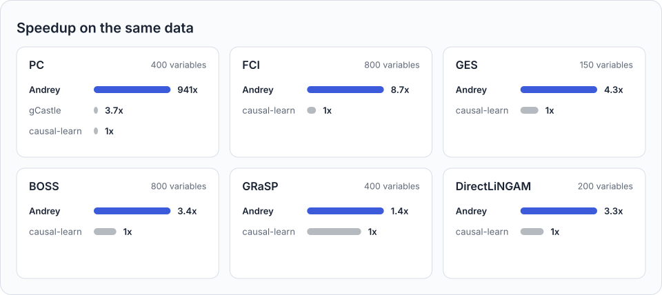

<!-- One image on its own dark ground reads on both GitHub themes; PyPI keeps a plain . -->
<p align="center">
  
</p>

<p align="center">
  <a href="https://pypi.org/project/andrey-core/"></a>
  <a href="https://github.com/Abel-ai-lab/andrey/actions/workflows/ci.yml"></a>
  
  <a href="https://github.com/Abel-ai-lab/andrey/blob/main/LICENSE"></a>
</p>

Andrey is a causal discovery package for Python.

<!-- PITCH:START -->
<!-- Generated by apps/build_launch.py; do not edit. -->

- **Fast**: Over 100x faster on PC, and faster on most other supported methods.
- **Just as accurate**: the same errors or fewer in 38 of 42 comparisons with other packages.
- **One API**: 18 methods, each one function call.
- **Agent-ready**: a command line that answers in JSON, and a skill for coding agents.

<!-- PITCH:END -->

```shell
uv add andrey-core
```

- **With pip**: `pip install andrey-core`
- **Optional extras**: `andrey-core[numba]` for compiled CPU code, `andrey-core[torch]` for GPUs
- **Development version**: `uv add git+https://github.com/Abel-ai-lab/andrey`
- **[Installation guide](https://andrey.abel.ai/docs/guides/getting-started.html#install)**: the
  extras, a PyTorch build for your GPU, and building Andrey from source

<!-- CHART:START -->
<!-- Generated from summary.json by apps/build_launch.py; do not edit. -->

<p align="center">
  <picture>
    <source media="(prefers-color-scheme: dark)"
      srcset=".github/readme/benchmark-chart-dark.svg">
    
  </picture>
</p>

<p align="center"><a href="https://andrey.abel.ai/docs/benchmarks.html">Benchmark report</a></p>

<!-- CHART:END -->

<!-- WHY_FAST:START -->
<!-- Generated from site/why_fast.py by apps/build_launch.py; do not edit. -->

Four ideas make it fast; each is animated in
[a blog post](https://andrey.abel.ai/blog/why-andrey-is-fast.html):

- **Do many things at once**: thousands of independence tests run as one array operation, with the
  same results.
- **Never compute twice**: the correlation matrix is computed once and cached; GES memoizes its
  local scores.
- **Skip what can't matter**: tests with a closed form settle most edges before any matrix is
  inverted.
- **Use the hardware you have**: with the optional extras, Numba compiles GES's path checks and a
  GPU computes large tables.

<!-- WHY_FAST:END -->

## What's inside

<!-- METHODS:START -->
<!-- Generated from andrey.spec by apps/build_launch.py; do not edit. -->

| Family | Methods | Returns |
|---|---|---|
| Constraint-based | [`pc`](https://andrey.abel.ai/docs/code/generated/andrey.pc.html), [`fci`](https://andrey.abel.ai/docs/code/generated/andrey.fci.html), [`gfci`](https://andrey.abel.ai/docs/code/generated/andrey.gfci.html)\*, [`cdnod`](https://andrey.abel.ai/docs/code/generated/andrey.cdnod.html)\* | CPDAG, PAG |
| Score-based | [`ges`](https://andrey.abel.ai/docs/code/generated/andrey.ges.html), [`gies`](https://andrey.abel.ai/docs/code/generated/andrey.gies.html)\*, [`hc`](https://andrey.abel.ai/docs/code/generated/andrey.hc.html)\*, [`exact_search`](https://andrey.abel.ai/docs/code/generated/andrey.exact_search.html)\*, [`calm`](https://andrey.abel.ai/docs/code/generated/andrey.calm.html)\* | CPDAG, DAG |
| Permutation-based | [`boss`](https://andrey.abel.ai/docs/code/generated/andrey.boss.html), [`grasp`](https://andrey.abel.ai/docs/code/generated/andrey.grasp.html) | CPDAG |
| Linear non-Gaussian | [`direct_lingam`](https://andrey.abel.ai/docs/code/generated/andrey.direct_lingam.html), [`ica_lingam`](https://andrey.abel.ai/docs/code/generated/andrey.ica_lingam.html), [`multi_group_direct_lingam`](https://andrey.abel.ai/docs/code/generated/andrey.multi_group_direct_lingam.html)\* | DAG |
| Time series | [`varma_lingam`](https://andrey.abel.ai/docs/code/generated/andrey.varma_lingam.html)\*, [`longitudinal_lingam`](https://andrey.abel.ai/docs/code/generated/andrey.longitudinal_lingam.html)\* | Temporal graph |
| Latent variables | [`gin`](https://andrey.abel.ai/docs/code/generated/andrey.gin.html)\* | DAG |
| Pairwise direction | [`pnl`](https://andrey.abel.ai/docs/code/generated/andrey.pnl.html)\* | Two-node DAG |

\* [Experimental](https://andrey.abel.ai/docs/code/index.html#experimental-methods):
no published benchmark yet, and the API may change.

<!-- METHODS:END -->

## Quick start

<!-- QUICKSTART:START -->
<!-- Generated by apps/build_launch.py, which runs the code; do not edit. -->

Learn the protein-signalling network of Sachs et al. (2005) from 853 cells, and score it against
the known network:

```python
import andrey
from andrey.data import load_dataset
from andrey.metrics import score

sachs = load_dataset("sachs")  # 853 cells, 11 proteins, and the known network
out = andrey.pc(sachs.data)    # learn a graph
print(out)

scores = score(out.structure, sachs.graph)
print({k: round(scores[k], 2) for k in ("shd", "skeleton_precision", "skeleton_recall")})
```

```text
PC  cpdag  |  11 nodes  |  8 edges (6 undirected, 2 directed)

  raf -- mek
  plc -- pip3
  pip2 -- pip3
  erk -- akt
  erk -- pka
  akt -- pka
  p38 -> pkc
  jnk -> pkc
{'shd': 11, 'skeleton_precision': 1.0, 'skeleton_recall': 0.47}
```

PC finds 8 edges, all among the known network's 17. The structural Hamming distance (SHD) counts
the edges to add, remove, or reorient to reach the known network: 11 here (9 edges are missing, and
2 are oriented that the known network leaves undirected), and 17 for a graph with no edges.

<!-- QUICKSTART:END -->

For your own data, pass a pandas DataFrame or a NumPy array: one row per sample, one column per
variable. From a shell or an agent:

```shell
andrey run pc --data your_data.csv   # JSON when piped, a summary in a terminal
andrey --skill                       # a guide an agent loads as a skill
```

## Learn more

- [Documentation](https://andrey.abel.ai/docs/): guides and the API reference.
- [Examples](https://andrey.abel.ai/docs/examples/): notebooks, one method or task each.
- [Demos](https://andrey.abel.ai/docs/demos/): step through methods and explore results in your
  browser.
- [Benchmarks](https://andrey.abel.ai/docs/benchmarks.html): every size, time, and error count.
- [Launch post](https://andrey.abel.ai/blog/introducing-andrey.html),
  [FAQ](https://andrey.abel.ai/docs/faq.html), and
  [changelog](https://andrey.abel.ai/docs/changelog.html).
- [Roadmap](https://andrey.abel.ai/docs/roadmap.html): the planned work, in order.

Andrey is in alpha: the API may change between releases, so pin the version you use. Linux is fully
tested; macOS and Windows install and run on the CPU, but the full test suite and the GPU speedups
(CUDA / MPS) are not tested there yet.

## Citing, license, contributing

If you use Andrey in your work, please cite it, or use the
[citation file](https://github.com/Abel-ai-lab/andrey/blob/main/CITATION.cff):

```bibtex
@software{andrey,
  author = {{Abel AI Lab}},
  title = {Andrey: A very fast causal discovery package},
  year = {2026},
  version = {0.1.0},
  url = {https://andrey.abel.ai},
}
```

Andrey is released under the
[Apache License 2.0](https://github.com/Abel-ai-lab/andrey/blob/main/LICENSE). Bug reports and pull
requests are welcome in the [issue tracker](https://github.com/Abel-ai-lab/andrey/issues); the
[contributing guide](https://github.com/Abel-ai-lab/andrey/blob/main/CONTRIBUTING.md) explains how
to set up a development environment.

Andrey is inspired by
[causal-learn](https://github.com/py-why/causal-learn), [pgmpy](https://github.com/pgmpy/pgmpy),
[Tetrad](https://github.com/cmu-phil/tetrad), and many other causal discovery packages.
